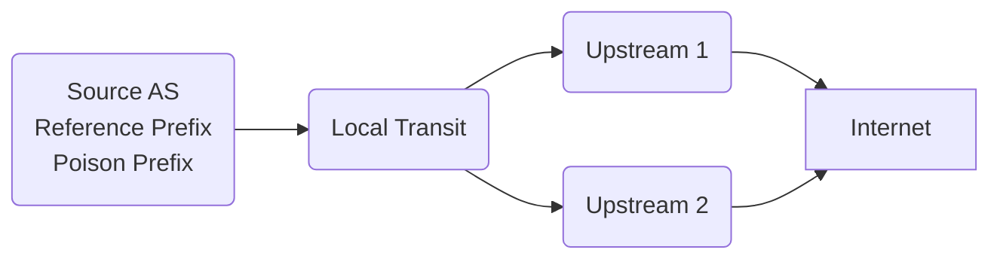
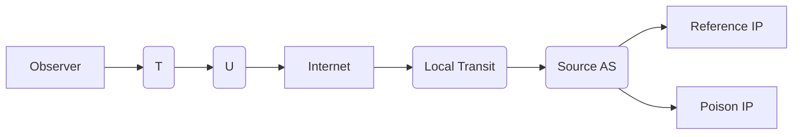
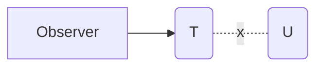
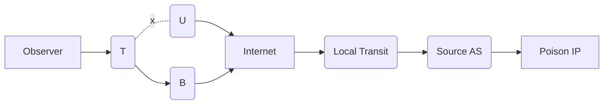
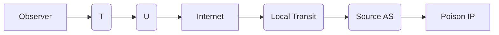

# Experiment

## Purpose

The goal of this experiment is to infer inactive (backup) paths in the AS
topology. Targets are large eyeball ASes that rely on a single upstream provider
for connectivity, according to collected BGP information. If the target AS has
no backup path available, an outage at the upstream provider may cause prolonged
service interruption.

We plan to run traceroutes from the target AS to a prefix controlled by us. We
will then poison the AS path of the announced prefix with the AS of the upstream
provider and observe how (or if) the path from the target changes. If a backup
path exists, it should be taken by the traceroute. Otherwise, the traceroute can
not reach our prefix anymore, indicating a loss of connectivity and total
reliance on the upstream provider.

This experiment allows us to identify and study these cases remotely and
highlight possible at-risk locations in the AS topology.

## Setup

We originate two prefixes from our `Source AS`: A `Reference Prefix` and a
`Poison Prefix`. The `Poison Prefix` will be announced with a poisoned AS path
as descried above. The purpose of the `Reference Prefix` is to act as a monitor,
i.e., without poisoning, for the experiment.

The `Source AS` peers with a `Local Transit` AS (also controlled by us), which
is statically configured to accept only announcements for these two prefixes to
prevent accidental route leaks during the experiment execution.

`Local Transit` uses two upstream providers to connect to the Internet.

## Methodology

First, we run traceroutes from an observer in the target AS  passing through the
upstream to the `.1` address of both prefixes. The `Reference IP` acts as a
control for the general connectivity.

Next, we poison the announcement of the `Poison Prefix` by injecting `U` in the
AS path, i.e., the path announced to the Internet will be `LocalTransit SourceAS
U SourceAS`.

The traceroutes from the observer to the control prefix *should* be unaffected.

There are three expected scenarios for traceroutes going to the poisoned prefix.

### 1. No backup

The traceroute does not leave the target AS.

### 2. Backup

The traceroute takes an alternative path through a backup AS `B`.

### 3. Default route

The traceroute continues to take the same path, indicating that AS `U` is
configured as the default route for AS `T`.

